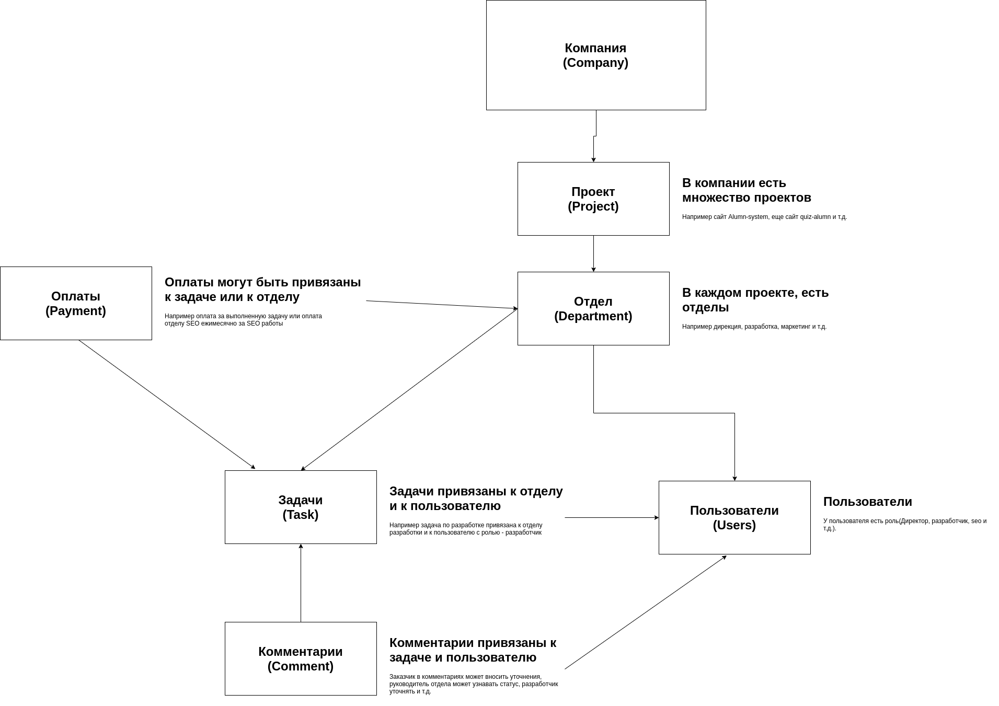

# Разработка на пхп

### Контейнеризация приложения
1. `git clone git@github.com:pavel-one/DevDocker2.git` - клонируем репозиторий  
1. `cd DevDocker2` - переходим внутрь папки  
1. `mv * ..` - переносим все что внутри папки на папку назад  
1. `mv .gitignore ..` - переносим .gitignore файл
1. `touch .env && make init` - инициализируем создание .env файла  
1. `sudo nano /etc/hosts` - прописываем адрес который указали при инициализации в hosts
1. `make up` - запускаем наш контейнер

По умолчанию http - 80 порт, а https - 443

### Инициализация композера
В проекте нам обязательно нужен композер, 
для его подключения и инициализации заходим в контайнер и выполняем 
`composer init` на все вопросы похую

